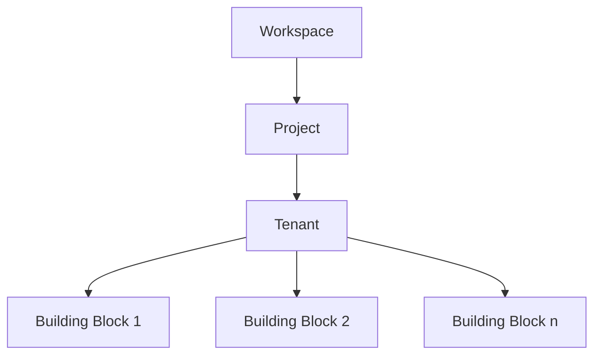

## Introduction

Building Blocks in meshStack are reusable infrastructure components that can be deployed and managed across your cloud environments. They represent pre-configured, organization-approved infrastructure pieces that teams can easily add to their tenants through the Service Catalog in the meshStack Marketplace.

<Info>
  Building Blocks are part of meshStack's Platform Services offering, alongside regular Platforms (like cloud providers) and OSB Services. They provide a standardized way to deploy common infrastructure patterns across your organization.
</Info>

## Architecture & Integration

Building Blocks are designed to work seamlessly within the meshStack ecosystem:

<CardGroup cols={2}>
  <Card title="Tenant Integration" icon="cloud">
    Building Blocks can be added to existing tenants, allowing you to enhance your cloud environment with additional infrastructure components as needed.
  </Card>
  <Card title="Platform Independence" icon="arrows-rotate">
    While some Building Blocks may be platform-specific, they're managed consistently through meshStack regardless of the underlying platform.
  </Card>
</CardGroup>

### Azure Stack Sets Integration

meshStack now supports Azure Stack Sets in landing zones, enabling powerful multi-subscription management capabilities:

<AccordionGroup>
  <Accordion title="Cross-Subscription Deployment" icon="network-wired">
    Azure Stack Sets allow Building Blocks to be deployed consistently across multiple Azure subscriptions, making it easier to maintain standardization at scale.
  </Accordion>
  
  <Accordion title="Centralized Management" icon="rectangle-list">
    Platform teams can define and update policies, resources, and configurations once and apply them across multiple subscriptions automatically.
  </Accordion>
  
  <Accordion title="Hierarchical Compliance" icon="shield-halved">
    Implement organization-wide governance policies that cascade down through your Azure subscription hierarchy while maintaining compliance at every level.
  </Accordion>
</AccordionGroup>

<Note>
  Azure Stack Sets integration is particularly useful for organizations managing multiple Azure subscriptions that need to maintain consistent policies, security controls, and resource configurations across their entire Azure estate.
</Note>

### Relationship with Projects and Tenants

Building Blocks operate at the tenant level within your meshStack projects:

## Key Features & Benefits

<AccordionGroup>
  <Accordion title="Standardization" icon="check-square">
    Building Blocks ensure consistent infrastructure deployment across your organization, reducing configuration drift and maintaining security standards.
  </Accordion>
  
  <Accordion title="Self-Service Deployment" icon="rocket">
    Teams can deploy pre-approved infrastructure components without waiting for platform team intervention, accelerating development cycles.
  </Accordion>
  
  <Accordion title="Governance & Compliance" icon="shield-check">
    All Building Blocks are vetted by platform teams, ensuring compliance with organizational standards and security requirements.
  </Accordion>
</AccordionGroup>

## Using Building Blocks

### Access and Deployment

1. Navigate to your tenant in the meshPanel
2. Select the Marketplace tab
3. Browse available Building Blocks
4. Configure and deploy the selected Building Block

<Note>
  Building Blocks available to you depend on your organization's setup and the specific platform/tenant you're working with.
</Note>

### Management and Monitoring

Once deployed, Building Blocks can be managed through the meshPanel:

<Steps>
  <Step title="Access Building Block Details">
    Navigate to your tenant and locate the Building Blocks section
  </Step>
  <Step title="Monitor Status">
    Check the current status and configuration of your deployed Building Blocks
  </Step>
  <Step title="Modify Configuration">
    Adjust settings as needed within the allowed parameters
  </Step>
  <Step title="Remove if Needed">
    Safely decommission Building Blocks when they're no longer required
  </Step>
</Steps>

## Best Practices

<Tip>
  Follow these guidelines to make the most of Building Blocks in your environment
</Tip>

1. **Plan Before Deployment**
   - Review the Building Block documentation thoroughly
   - Understand dependencies and requirements
   - Consider the impact on existing infrastructure

2. **Regular Maintenance**
   - Monitor Building Block status regularly
   - Keep configurations up to date
   - Remove unused Building Blocks to optimize resources

3. **Security Considerations**
   - Follow the principle of least privilege
   - Regularly review access patterns
   - Maintain compliance with security policies

<Warning>
  Always test Building Block deployments in non-production environments first to understand their behavior and impact on your infrastructure.
</Warning>

## Common Use Cases

Building Blocks are particularly useful for:

- Setting up standardized networking configurations
- Deploying security controls and monitoring solutions
- Establishing consistent backup and disaster recovery solutions
- Implementing organization-specific compliance requirements
- Managing Azure Stack Sets across multiple subscriptions

## Troubleshooting

If you encounter issues with Building Blocks:

1. Check the Building Block's status in the meshPanel
2. Review the configuration for any misconfigurations
3. Consult the Building Block's documentation
4. Contact your platform team if issues persist

<Note>
  Remember that Building Blocks are maintained by your organization's platform team. The available options and configurations may vary based on your organization's specific needs and policies.
</Note>