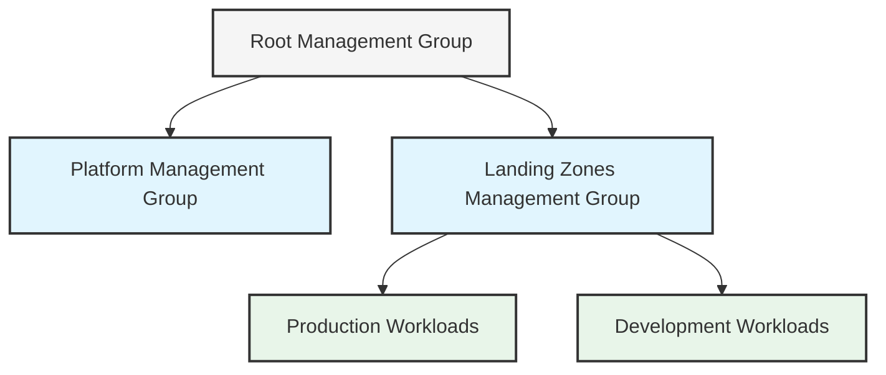

# Azure Landing Zones in meshStack

meshStack implements Azure Landing Zones using native Azure concepts and best practices to provide secure, compliant, and well-architected cloud environments. This guide explains how Azure Landing Zones work in meshStack and what you can expect when using them.

## What is an Azure Landing Zone?

An Azure Landing Zone is a pre-configured environment that implements proven practices for establishing secure and well-managed Azure subscriptions. In meshStack, Landing Zones combine several Azure concepts:

- Azure Management Groups for hierarchical organization
- Azure Policies for governance and compliance
- Azure Blueprints for consistent resource deployment
- Azure RBAC for access management

<Tip>
  Landing Zones help you get started quickly while ensuring compliance with your organization's standards and security requirements.
</Tip>

## Key Components

### Management Groups

Management Groups provide a governance scope above subscriptions, allowing you to:

- Apply policies across multiple subscriptions
- Delegate administrative access
- Establish a hierarchical organization structure

<Frame>

</Frame>

### Azure Policies

meshStack's Azure Landing Zones come with pre-configured policies that:

<CardGroup cols={2}>
  <Card title="Security Baseline" icon="shield-halved">
    Enforce security controls like encryption, network security, and monitoring
  </Card>
  <Card title="Compliance" icon="check-double">
    Ensure resources meet regulatory and organizational compliance requirements
  </Card>
  <Card title="Cost Management" icon="coins">
    Implement cost controls and budget monitoring
  </Card>
  <Card title="Resource Consistency" icon="cubes">
    Standardize resource configurations across subscriptions
  </Card>
</CardGroup>

### Azure Blueprints

meshStack uses Azure Blueprints to:

- Deploy consistent environments
- Track blueprint versions
- Maintain compliance through blueprint assignments
- Automate resource deployment

## Available Landing Zone Templates

meshStack offers several Azure Landing Zone templates to match different workload requirements:

<AccordionGroup>
  <Accordion title="Standard Production" icon="industry">
    Designed for production workloads with:
    - Strict security controls
    - High availability requirements
    - Comprehensive monitoring
    - Cost optimization features
  </Accordion>
  <Accordion title="Development" icon="code">
    Optimized for development and testing:
    - Flexible security controls
    - Cost-effective configurations
    - Quick provisioning
    - Development-specific tools
  </Accordion>
  <Accordion title="Sandbox" icon="box">
    For exploration and learning:
    - Limited resource quotas
    - Basic security controls
    - Cost restrictions
    - Temporary duration
  </Accordion>
</AccordionGroup>

## Using Azure Landing Zones

### Selection Process

<Steps>
  <Step title="Choose a Template">
    Select the appropriate landing zone template based on your workload requirements
  </Step>
  <Step title="Configure Parameters">
    Provide required information such as:
    - Environment type
    - Compliance requirements
    - Network settings
    - Resource naming conventions
  </Step>
  <Step title="Review and Deploy">
    Review the configuration and deploy your landing zone
  </Step>
  <Step title="Access Resources">
    Start using your configured Azure environment
  </Step>
</Steps>

### Best Practices

When using Azure Landing Zones in meshStack:

<Check>
  - Use the appropriate template for your workload type
  - Follow the naming conventions specified in your organization's guidelines
  - Review and understand the applied policies before deployment
  - Monitor resource usage and costs regularly
  - Keep landing zone configurations up to date
</Check>

## Compliance and Governance

Azure Landing Zones in meshStack implement various compliance and governance features:

<Tabs>
  <Tab title="Security Controls">
    - Network security groups
    - Azure Security Center integration
    - Identity and access management
    - Encryption requirements
  </Tab>
  <Tab title="Compliance Policies">
    - Industry-specific regulations
    - Internal compliance requirements
    - Audit logging
    - Data sovereignty rules
  </Tab>
  <Tab title="Cost Management">
    - Budget alerts
    - Resource tagging
    - Cost allocation
    - Usage monitoring
  </Tab>
</Tabs>

## Customization Options

While landing zones come with pre-configured settings, they can be customized to meet specific requirements:

- Policy assignments and parameters
- Network configurations
- Security controls
- Resource naming patterns
- Tag schemas

<Note>
  Contact your meshStack administrator for customization requests that align with your organization's standards.
</Note>

## Troubleshooting

If you encounter issues with your Azure Landing Zone:

1. Check the deployment logs in the meshStack panel
2. Verify policy compliance in Azure Portal
3. Review resource configurations
4. Contact support for assistance

## Next Steps

- Review available landing zone templates
- Plan your workload requirements
- Consult with your cloud team for specific customization needs
- Start deploying your Azure resources using landing zones