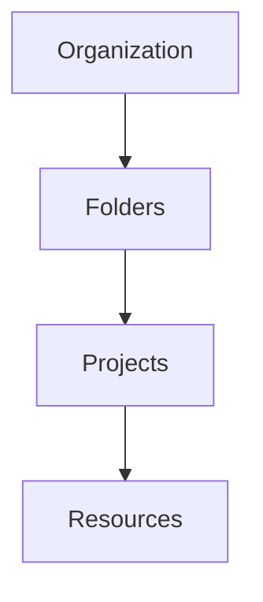

# GCP Landing Zones in meshStack

Landing zones in Google Cloud Platform (GCP) provide a foundation for deploying cloud resources according to your organization's security, compliance, and operational requirements. meshStack integrates seamlessly with GCP's native organizational structure and management capabilities to deliver standardized, compliant environments.

## GCP Organizational Structure

Before diving into landing zones, it's important to understand GCP's resource hierarchy:

<Frame>

</Frame>

- **Organization**: The root node and highest level in the GCP hierarchy
- **Folders**: Optional organizational units that group projects
- **Projects**: Core containers for resources and services
- **Resources**: Individual GCP services and components

## Landing Zone Components

GCP landing zones in meshStack typically include:

<CardGroup cols={2}>
  <Card title="Resource Hierarchy" icon="sitemap">
    Predefined folder structures and project organization aligned with your governance model
  </Card>
  <Card title="IAM & Security" icon="shield-halved">
    Standardized Identity and Access Management policies, service accounts, and security controls
  </Card>
  <Card title="Networking" icon="network-wired">
    VPC configuration, subnets, and connectivity options based on your requirements
  </Card>
  <Card title="Compliance" icon="check-double">
    Built-in compliance controls and monitoring setup according to your standards
  </Card>
</CardGroup>

## How meshStack Implements GCP Landing Zones

meshStack automates the implementation of GCP landing zones through:

<Steps>
  <Step title="Project Creation">
    When a user requests a new GCP project through meshStack, the system automatically:
    - Creates a new GCP project
    - Places it in the appropriate folder hierarchy
    - Applies standard labels and naming conventions
  </Step>
  <Step title="Policy Application">
    meshStack applies:
    - Organization policies
    - IAM roles and permissions
    - Resource constraints
    - Compliance requirements
  </Step>
  <Step title="Resource Configuration">
    Automatically sets up:
    - Network configuration
    - Security controls
    - Monitoring and logging
    - Service enablement
  </Step>
</Steps>

## Available Landing Zone Templates

meshStack supports multiple GCP landing zone templates to match different use cases:

<AccordionGroup>
  <Accordion title="Development Environment" icon="code">
    Optimized for development and testing:
    - Relaxed security controls
    - Developer-friendly service enablement
    - Cost optimization features
  </Accordion>
  <Accordion title="Production Environment" icon="industry">
    Enhanced security and reliability:
    - Strict access controls
    - High availability configuration
    - Complete audit logging
  </Accordion>
  <Accordion title="Data Analytics Environment" icon="database">
    Specialized for data workloads:
    - BigQuery optimizations
    - Data governance controls
    - Analytics service enablement
  </Accordion>
</AccordionGroup>

## Best Practices

When working with GCP landing zones in meshStack:

<Tip>
Follow these recommendations for optimal results:
- Start with the most restrictive template that meets your needs
- Use resource hierarchy tags for better organization
- Regularly review IAM permissions and access patterns
- Monitor resource usage and costs
</Tip>

## Common Use Cases

Here are some typical scenarios where GCP landing zones are particularly valuable:

<CardGroup cols={2}>
  <Card title="Enterprise Applications" icon="building">
    For organizations deploying multiple business applications with strict governance requirements
  </Card>
  <Card title="Development Teams" icon="code">
    Supporting multiple development teams with isolated environments and standardized tooling
  </Card>
  <Card title="Data Projects" icon="database">
    For teams working with sensitive data requiring specific security and compliance controls
  </Card>
  <Card title="Multi-Environment Setup" icon="layer-group">
    Organizations maintaining separate development, testing, and production environments
  </Card>
</CardGroup>

## Customization Options

While landing zones provide standardized templates, meshStack allows customization in several areas:

<ResponseField name="Network Configuration" type="object">
  - Custom VPC designs
  - Specific IP ranges
  - Connection options to on-premises networks
</ResponseField>

<ResponseField name="Security Controls" type="object">
  - Custom IAM roles
  - Organization-specific policies
  - Security monitoring rules
</ResponseField>

<ResponseField name="Service Configuration" type="object">
  - Enabled/disabled services
  - Service-specific quotas
  - API restrictions
</ResponseField>

## Getting Started

To begin using GCP landing zones in meshStack:

1. Review available landing zone templates
2. Identify your requirements for:
   - Security
   - Compliance
   - Network connectivity
   - Resource access
3. Select the appropriate template
4. Request your GCP project through meshStack

<Note>
Contact your meshStack administrator if you need a custom landing zone template or have specific requirements not covered by existing templates.
</Note>